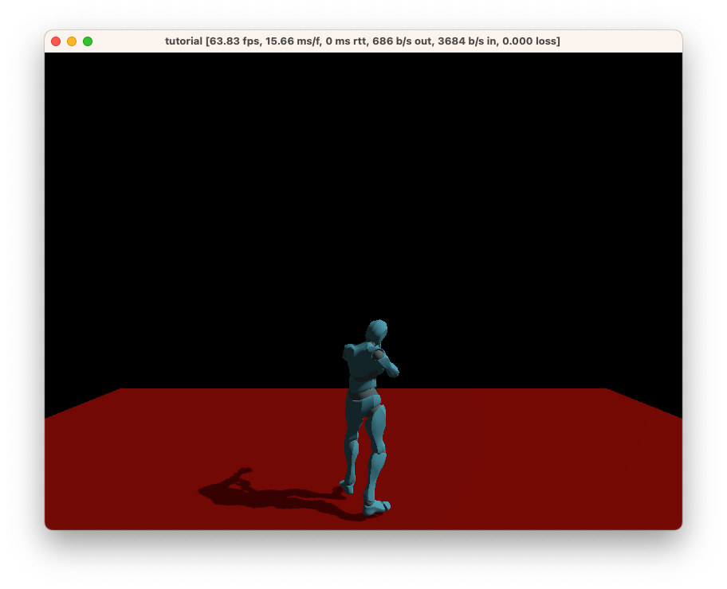

# Chapter 2: Adding a player character

In this chapter, we'll add a floor to the scene, and then a player character that can run around in the world.

## Creating a floor

First, remove all code within `fn main` in `server.rs`, and replace it with the following:

```rust
Entity::new()
    .with(quad(), ())
    .with(scale(), Vec3::ONE * 10.0)
    .with(color(), vec4(1.0, 0.0, 0.0, 1.0))
    .with(plane_collider(), ())
    .spawn();
```

This will create a basic ground plane for us. Note that you will have also removed the camera, so you will not be able to see the plane yet. That's normal!

> **Tip**: When you save the file, the components are likely to have red squiggly lines under the components; that's because they aren't imported yet. Click one of them, then hit `Ctrl-.` (or `Cmd-.` on macOS) and choose "Import ...".

> **In-depth**: Visit the [full api reference docs](https://docs.rs/ambient_api/latest/ambient_api/) for details on how `Entity`, `.with` and `.spawn` works.

> **In-depth**: Entities are the basic unit in an ECS. You can think of the ECS as a database, where _entities_ are rows, and _components_ (`quad`, `scale`, `color` and `plane_collider` in this case) are columns.
>
> Components are always pure data; they don't have any functionallity on their own. Instead, you typically write queries that read and write from the ECS (_systems_). [Read more about the ECS here](../../reference/ecs.md).

## Adding a player controller

Ambient supports dependencies, similar to Rust's Cargo. To help you in your game-making journey, we've created several standard packages that you can use.

We're going to use some of these packages to build our experience today. Start by adding the following to your `ambient.toml`:

```toml
[dependencies]
base_assets = { deployment = "PVOekES8qWVLm5O6VOdZl" }
fps_controller = { deployment = "2L3PZj85t8X8Q2PQV9NvfM" }
character_animation = { deployment = "3ZfO5zBKLV5KNYvxTpkgEE" }
hide_cursor = { deployment = "34ivXRz9ZMYzfGEjZ689lv" }
```

> **In-depth**: To learn more about dependencies, check out the [reference documentation](../../reference/package.md#dependencies--dependencies).

Add the following code to `server.rs`:

```rust
spawn_query(is_player()).bind(move |players| {
    for (id, _) in players {
        entity::add_components(
            id,
            Entity::new()
                .with(use_fps_controller(), ())
                .with(model_from_url(), packages::base_assets::assets::url("Y Bot.fbx"))
                .with(basic_character_animations(), id),
        );
    }
});
```

> **Note**: As before, you will need to import these components from their packages. You can use `Ctrl+.` (or `Cmd+.` on macOS) to do this.

> **In-depth**: A `spawn_query` runs when an entity with a specific set of components is seen for the first time (including when it is spawned).
>
> Here, when a player spawns, we add a few components to that player to give it an animated model (`model_from_url`), use basic character animations (`basic_character_animations`) and to make it react to input with a camera that follows the character (`use_fps_controller`).
>
> [Read more about queries here](../../reference/ecs.md#systems).

Run your game by pressing `F5` in VS Code (or by typing `ambient run` in your terminal).

You should now see something like this on the screen:



This character will respond to input, including moving around using WASD, jumping with Space, and looking around with the mouse.

Congratulations! You can now use this character as a base for the rest of the tutorial.

> **Challenge**: Add a `camera_distance` component to `-1.0` for a first-person-like experience.

## [⇾ Chapter 3: Scene](./3_scene.md)
