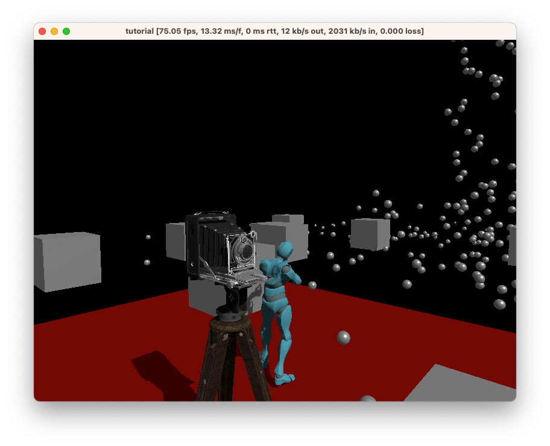

# Chapter 5: Working with models

Games typically don't just use cubes and spheres. Instead, they use 3D models. In this chapter, we'll learn how to load and use 3D models in Ambient.

Let's download [this free sample model from the official glTF sample repository](https://github.com/KhronosGroup/glTF-Sample-Models/blob/master/2.0/AntiqueCamera/glTF-Binary/AntiqueCamera.glb).

Click the little download icon to the right to download it.

Next, create a folder named `assets` in your project, and add the file to that folder (see [package structure](./1_package.md#package-structure)).

Create a file called `pipeline.toml` in the `assets` folder, with the following content:

```toml
[[pipelines]]
type = "Models"
sources = ["*.glb"]
```

Note that this should **not** go in your `ambient.toml`. Pipelines are separate and are folder-specific.

> **In-depth**: To learn more about how asset pipelines work, consult [the reference documentation](../../reference/asset_pipeline.md).

Finally, let's use the model. In our `server.rs`, add the following lines:

```rust
Entity::new()
    .with_merge(Transformable {
        local_to_world: Default::default(),
        optional: TransformableOptional {
            scale: Some(Vec3::ONE * 0.3),
            ..Default::default()
        },
    })
    .with(model_from_url(), assets::url("AntiqueCamera.glb"))
    .spawn();
```

This creates a new entity with the `AntiqueCamera` model. This model will be loaded in on the client.

You should now see something like this:



Great! We've learned how to load models into Ambient.

> **Tip**: Use `prefab_from_url` instead of `model_from_url` if you also want to include a collider.
>
> This instantiates a prefab for the model that includes a collider. However, note that the antique camera here does not have a collider and you will need to consider adding a collider through the primitive colliders or through another source.
>
> See [the physics example](https://github.com/AmbientRun/Ambient/tree/main/guest/rust/examples/basics/physics).

## [ ⇾ Chapter 6: UI](./6_ui.md)
