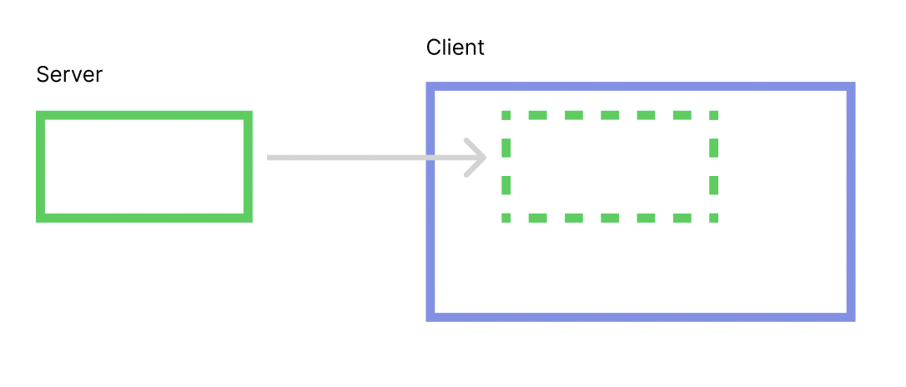

# Overview of Ambient

Let's start with a rough overview of Ambient to give you an idea of how it works.

## The database (ECS)

The most central thing in Ambient is the [ECS](../reference/ecs.md) "world". You can think of it
as a database which stores everything in your application.

The world is a collection of entities, an entity is a collection of components and a component is a
(name, value) pair. For example, you could have an entity with two components;

```yml
entity 1932:
    - translation: (5, 2, 0)
    - color: (1, 0, 0, 1)
```

If you compare this to a traditional sql database, you can think of entities as rows and
components as columns. There are no tables though; any component can be attached to any
entity.

## Client/server

The next thing to know is that Ambient is built around a client/server architecture. Both
the server and the client have a world of their own (green and blue boxes in the image below).



The server's world is then automatically replicated to all clients' worlds. The clients can
have then add aditional entities and/or components to their local world. Typically, you'll
have game state on the server, and visual effects or other client-local state on the clients.

The replication is one way though; any changes you make to your client world will _not_ be replicated
to the server. To communicate from the client to the server you will typically use
[message passing](../reference/networking.md#messaging) instead.
